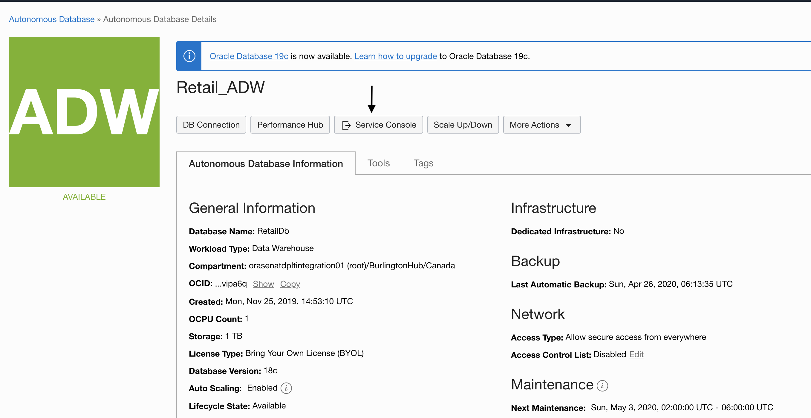

# Lab 300: 

## Introduction


### Objectives


### Required Artifacts

Estimated time to complete this lab is two hours.

### Additional Resources

## Part 1. Establish connections in Oracle Integration Cloud

### Step 1: Establish connection from MySQL to Oracle Integration Cloud

### Step 2: Establish an integration between the ADW and MySQL connections

1. Some text here




```
Code Snippets


```


