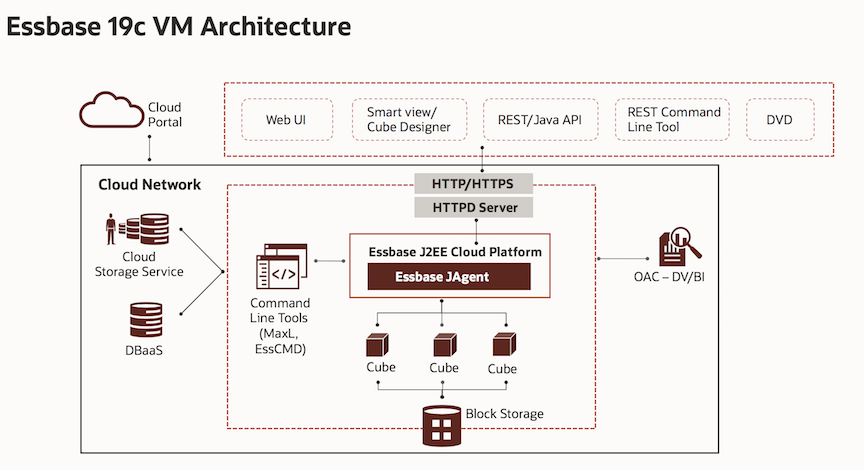

# Introduction to Essbase

## Introduction

Oracle Essbase is a business analytics solution that uses a proven, flexible, best-in-class architecture for analysis, reporting, and collaboration. Essbase delivers instant value and greater productivity for your business users, analysts, modelers, and decision-makers, across all lines of business within your organization.

Oracle Essbase on cloud helps you to build your company’s cloud strategy efficiently by avoiding data and business process fragmentation. Oracle Essbase can be easily deployed on Oracle Cloud Infrastructure, which can then be widely used to solve simple to complex business analytics use cases across all industries. It is designed to help you model business performance levels and deliver what-if analyses for varying conditions. Using Oracle Identity Cloud Service, Essbase can utilize enterprise-wide user profiles to work and integrate with Oracle Cloud.

## Features of Oracle Essbase

• Oracle Essbase provides a complete set of tools and features for deriving and sharing data insights.

• Both large organizations and small teams can share data more simply, without the need to manage or consolidate multiple versions of spreadsheets, and quickly perform ad hoc analysis of the spreadsheet data.

• Application developers can utilize interfaces that enable them to extend, customize, and embed rich analytic experiences in the application flow.

• With Oracle Essbase, you can take data from any source, and explore and collaborate with real-time data, using a               multidimensional engine.

• With Essbase on cloud you can create and manage Essbase applications from Microsoft Excel by using Cube Designer.

• Create connections and data sources for drill-through, data loads, and dimension builds.

• We can use Essbase to collect collaborative data, create scenarios, and perform what-if analysis using Smart View.

## Essbase 19c VM Architecture 

The following architecture diagram shows Essbase 19c deployed on Oracle infrastructure cloud (OCI) with integration to different cloud services - Autonomous Database, Load Balancer, Storage, Virtual Cloud Network (VCN) as part of the deployment.

* Essbase19c VM resides in the Application subnet as shown in the above figure which is configured automatically with Block Volumes – Configuration Volume & Data Volume. 

* The connections to this application subnet are dependent on the Security List rules associated with the Application subnet. In this topology we will have ingress rules on the application subnet for SSH Connectivity and for HTTPS - Web UI connectivity to the Essbase19c VM via the Internet Gateway.

* SSH connectivity is first required during the procurement process for the Resource Manager to configure & install the Essbase19c in the compute instance automatically with no manual work from our end and secondly after the procurement SSH connectivity enables the users to login to the backend Essbase19c instance and for corresponding access.

* The Essbase19c instance procured will manage its users using the IDCS of Oracle Cloud & metadata gets stored in the ATP-Autonomous Database.

* Essbase backups gets stored in the Object storage of the OCI & the connectivity to this is established by the service gateway.

*Note:* This lab is intended to be a comprehensive full cloud showcase. As such, it is assumed a user going through this workshop will be provisioning resources and creating users from scratch. If you decide to use existing infrastructure or resources, be aware and keep note of your namings so resources don't overlap and conflict.

*Note:* Additionally, as much as possible, do not stray away from the naming conventions used for resources in this worshop. You may run into errors if you do.

## Working with Essbase

During our workshop we will help fictitious company Dynamic Corporation to perform financial analysis. Dynamic Corp. is a high-tech manufacturer of hard disk drives. It is headquartered in California, Bay Area. Dynamic Corp. has its operations spread across multiple regions. Various departments within Dynamic Corp. performs financial analysis.

Financial analysis develop number of reports as follows:

*1. Sales department*

* Monthly sales revenues by product , by customer
* Current year actual, budget , forecast data
* Customer sales by region

*2. Finance department*
			
* Current year actual and budget data
* Monthly product development reports 
* Details of company cost structures

Dynamic corp extensively use Microsoft Excel application for Financial reporting. Financial analyst at Dynamic Corp are well versed with use of Excel. But with growing business they find it difficult to manage reporting with excel. They found out Excel is a widely used tool for two dimensional data analysis, but presents enlisted limitations when used for multidimensional data analysis -

1. Disconnected
2. Data Security Risks
3. Error Prone
4. Scalability issues
5. Lack of audit trails/log mechanism
6. Tedious and multi-step calculations

To overcome these limitations and to proceed with an efficient and precise multi-dimensional data analysis, Essbase comes to the rescue. Essbase can be defined as a multidimensional database (comparable to Excel pivot table) offering following benefits -

• One single location for data – all analysts are using the same data, business drivers, and metrics for calculating departmental budgets.

• Standardization of Business Drivers – budget drivers can be loaded and calculated by the administrator so that all budgets are using the same methodology.

• Security – the administrator can apply security to certain dimensions and members, giving users access to only the data that they are responsible for. This allows more participation from the field in the budget process.

• Workflow - the administrator can completely control the workflow and approval process. Planning Units must be reviewed and approved before going up to the next approval level.

• Easy to consolidate – Hyperion Planning data is stored in a Hyperion Essbase OLAP database using hierarchies that make the consolidation process effortless.

With the above stated benefits, it’s certainly worthwhile to understand the nitty-gritty of Essbase, its benefits, features and applications. This lab intends towards providing a holistic view of Essbase, its features, and applications.

### Required Artifacts

This lab will require the following -

1. An Oracle public cloud tenancy where you have the resources available to provision an ADW instance with 2 OCPUs, an Essbase   instance with 2 OCPUs

2. [Smartview Plugin](https://docs.oracle.com/en/cloud/paas/analytics-cloud/essug/download-and-run-smart-view-installer.html) 

3. [Cube Designer Plugin](https://docs.oracle.com/en/cloud/paas/analytics-cloud/essug/install-smart-view-cube-designer-extension.html)

### Installing Smartview Plugin

#### Smart View Prerequisites
1. The latest release of Smart View
2. On the Oracle Technology Network Downloads tab, the latest release for Smart View is always certified.
3. Microsoft Office 2010, 2013 or 2016
4. .NET Framework 4.0

* Note:You must use .NET Framework 4.5 if you are installing Smart View from Essbase without saving the installer locally.

#### Installation Steps 
1. Log into Essbase.
2. Click Console.
3. On the Desktop Tools tab, click the Browse icon to the right of Smart View for Essbase.
4. On the Smart View download page on Oracle Technology Network, click Accept License Agreement, and then click Download Now.
5. If the Oracle sign-in page is displayed, then sign in with your Oracle user name (usually your email address) and password.
6. Follow the steps for your browser to download the .zip file, and save it to a folder on your computer.
7. Go to the folder that you used in Step 5, and then double click smartview.exe to start the installation wizard.
8. Select a destination folder for Smart View, and then click OK. For new installations, Smart View is installed by default in: C:\Oracle\smartview.
9. If you are upgrading an installation of Smart View, then the installer defaults to the folder where you previously installed Smart View.
10. When the installation is complete, click OK.

### Installing Cube Designer Plugin

#### Installing Cube Designer from Smart View

1. On the Smart View ribbon, select Options, and then Extensions.
2. Click the Check for updates link.
3. Smart View checks for all extensions that your administrator has made available to you.
4. Locate the extension named Oracle Cube Designer and click Install to start the installer.
5. Follow the prompts to install the extension.

#### Installing Cube Designer from Essbase

1. In Essbase, click Console.
2. On the Desktop Tools tab, to the right of Cube Designer Extension, click Download .
3. In the Opening CubeDesignerInstaller.svext dialog box, select Save File and click OK.
4. Save the file to a local directory.
5. Close all Microsoft Office applications and make sure Microsoft Office applications are not running in the background.
6. Double click the CubeDesignerInstaller.svext file.
7. Restart Microsoft Office applications.

## Register for Free Oracle Trial Account
* Bookmark this page for future reference.

* Please click on the URL to receive your [Free Account](https://myservices.us.oraclecloud.com/mycloud/signup?language=en&sourceType=:ex:tb:::RC_NAMK190227P00084:PredictDemandML_ADW_HOL&SC=:ex:tb:::RC_NAMK190227P00084:PredictDemandML_ADW_HOL&pcode=NAMK190227P00084) and complete all required steps. When you complete the registration process you'll receive a $300 credit that will enable you to complete the lab for free. Additionally, you'll have 1000s of hours left over to continue to explore the Oracle Cloud.

* Soon after requesting your trial you will receive an activation email. Once that email is received and you have logged in to your environment you can begind the lab.

Access the labs using our web-friendly interface [here](https://bangaloresolutionshub.github.io/essbaseworkshop/) 
